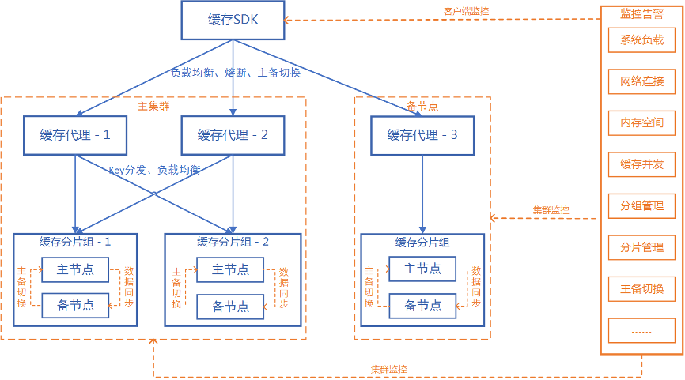

### 主要功能
* 客户端实现负载均衡、主备切换、熔断处理、运行监控功能。
* 支持普通的redis连接协议，咱不支持redis-cluster集群连接协议。
* 负载均衡功能。适用于使用codis-proxy和twemproxy的场景，在客户端实现代理层水平扩展。客户端实现redis请求的分发，数据一致性性需由redis集群统一管理。
* 主备自动切换。在主节点熔断时，自动切换至备节点；主节点会正常后，重新切换回主节点。只在客户端实现主备切换功能，主备的数据同步需要由运维同学处理。
* 在客户端监控redis连接熔断状态、主备切换状态，通过单例类实时获取。
* 与spring-boot无缝集成，配置简单。
* 对于豌豆荚codis，在客户端直接拦截codis不支持的命令。例如：rename、publish等。

### 架构图


### maven依赖
```
<dependency>
    <groupId>com.github.rtf666</groupId>
    <artifactId>redis-sdk-plus</artifactId>
    <version>1.0.4</version>
</dependency>
```

### 配置说明
```
spring:
  redis:
    database: 1
    port: 6380
    host: 172.18.223.230,172.18.223.231;172.18.223.231
    password: 123456
    type: redis
```
* 主备节点。使用“;”区分主备节点，主节点都连接不上时，自动切换至备节点。
* 负载均衡节点。redis主节点可以配置多个，不同的入口节点使用“,”分隔。
* 所有节点的密码、端口必须相同。
* type: 选择服务端redis集群类型，非必填，可选值：redis、codis，默认为redis。设置为codis则在客户端拦截codis不支持的命令。

### 问题反馈
* [点击反馈问题](https://blog.csdn.net/lp895876294/article/details/114461393)

### 感谢
* [codis](https://github.com/CodisLabs/codis)

